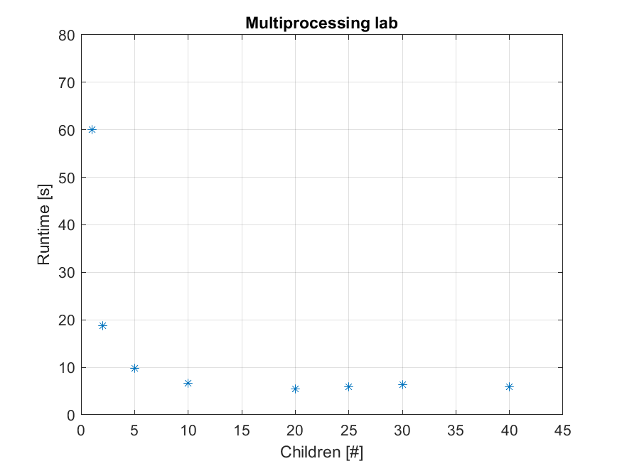

# System Programming Lab 11 Multiprocessing

- This lab generates a Mandelbrot set images using multiprocessing. The images are created by running the mandel program multiple times using child processes (fork()) with a different scale (-s) each time to zoom into the mandelbrot set. The program allows the number of children to be configured at the command line as well as how many frames (can just put 50 for lab).

- 

- The graph shows that between 1-20 child processes the runtime does speedup the operation. It looks like exponential decay. However, once it gets bigger than about 20, the runtime does not improve and starts to stabalize. Sometimes the runtime was worse if I used more children.