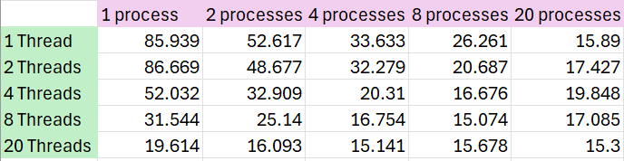
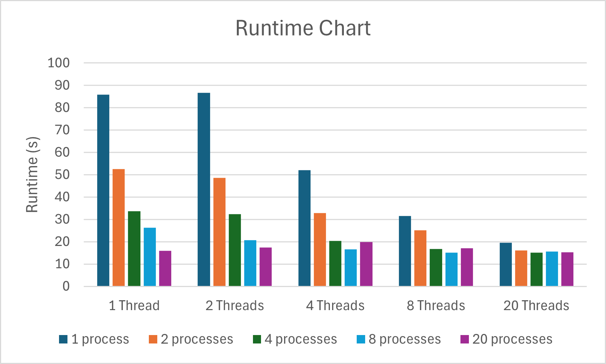

# System Programming Lab 11 Multiprocessing

- This lab generates a Mandelbrot set images using multiprocessing. The images are created by running the mandel program multiple times using child processes (fork()) with a different scale (-s) each time to zoom into the mandelbrot set. The program allows the number of children to be configured at the command line as well as how many frames (can just put 50 for lab).

- 

- The graph shows that between 1-20 child processes the runtime does speedup the operation. It looks like exponential decay. However, once it gets bigger than about 20, the runtime does not improve and starts to stabalize. Sometimes the runtime was worse if I used more children.

# Lab 12 Multithreading

- This lab adds onto the previous lab and implements multithreading using pthreads. A command line argument was added (-t) for how many threads the user wants. The image is divided into regions and each thread does a region to compute a single image. This optimizes the computation of the Mandelbrot set images.

- 

- i) Multithreading has a more significant impact on reducing runtime. Multithreading produced lower runtimes as I added more threads. With 1 thread, the runtime drops from 85.939 s to 15.89 s. After about 20 processes the runtime gets worse. Multithreading probably impacts runtime more because it allows to share memory and resources. It can also parallelize the work making it faster because the threads can compute different regions simultaneously.

- ii) I got a "sweet spot" at about 8 processes and 9 threads with a runtime of 14.481 s. 

- 

- For visualization of the runtime.